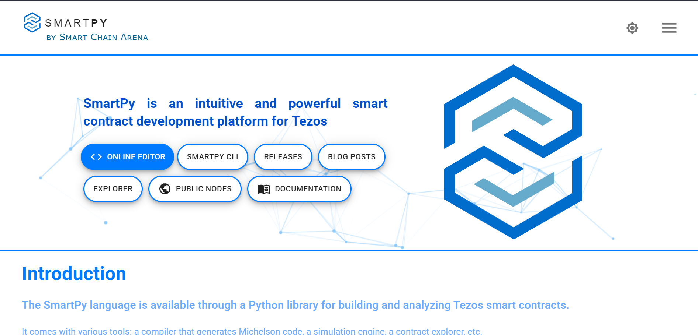

# Introduction
Hey Reader! Welcome to this Tutorial on How to write, deploy & interact with a smart contract on Tezos in SmartPy. We will be learing a lot and having fun alongside!
You will be able to understand the industry standards of coding on SmartPy and be able to deploy your own Calculator Smart Contract whilist Understading the code as well.

- Tezos is an open-source blockchain protocol for assets and applications backed by a global community of validators, researchers, and builders. The Tezos protocol is secure, upgradable, and built to last.
- SmartPy is an intuitive and powerful smart contract development platform for Tezos and is available through a Python library for building and analyzing Tezos smart contracts.


# **Prerequisites**

You need basic understanding of Python Language. Rest all will be covered from getting XTZ from the Faucet to Coding and Deployment!


# **Requirements**

You will need to have Temple Wallet Installed in your browser. Get it [HERE](https://templewallet.com/).


# Body of the Tutorial
## Section 1 : SmartPy IDE
Hi all ! Let me start with explaining what SmartPy actually is ,  SmartPy is a high-level smart contracts library and comes with related tools in the form of [SmartPy.io](https://smartpy.io/) to greatly ease the accessibility, understandability and provability of smart contracts on Tezos.

So Head on over to [SmartPy.io](https://smartpy.io/) and let us begin writing our First Smart Contract!

When you reach SmartPy.io , You will have a screen like below



Here we have two important links namely 
- [Online Editor](https://smartpy.io/ide)
- [Documentation](https://smartpy.io/docs/)

The Online Editor will help us write , execute and test our Smart Contract before it is deployed on the Blockchain and Documentation will help us with various DataStructures , Conditions , DataTypes and much more!

Click on Online Editor Button and you will get a screen like below

___IMAGE___

Here SmartPy has provided us with various Template and sample contracts. It includes Games , Token Contracts and some basic Utility Contracts.
We will be coding our own version of Calculator Contract that is present as one of the Examples.

Before we start on with the coding we need to cover some of the basics

We will be importing SmartPy library and use it throughout the Contract

```
import smartpy as sp
```
And the functions of SmartPy will be called with the prefix sp.

Moving on Python does not support direct conversion of Python Code to Michelson. Hence we would have to use functions present in SmartPy to even do basic operations. 
- sp.if
- sp.else
- sp.verify
- sp.for
- sp.while

You can check out usage of loops and conditions in SmartPy in the [Documentation](https://smartpy.io/docs/)

Next We have to understand that all SmartContracts are essentially Python Classes which have to be inherited from ```sp.Contract``` , All the Class Attributes will taken as the Contract Storage and All the Class methods will be considered as EntryPoints of the Contract which we can call from FrontEnd to change the state of the Contract.

**NOTE: No change will take place in the Contract unless called the user via EntryPoint**

Now on to Coding our Contract:
We will import SmartPy Library

```
import smartpy as sp
```

Create a Python Class that inherits the class ```sp.Contract``` and define it's Storage

```
class Calculator(sp.Contract):
    def __init__(self):
        self.init(value = 0)
```
Here we have taken a variable *value* and defined it's intial value as 0

As we know that Python does not support direct conversion of Python Code to Michelson, we use different Data Types as well. For Example:
- sp.TInt 
- sp.TBool
- sp.TTimestamp
- TBytes

And Also Tezos Specific Data Types like:
- sp.TAddress
- sp.TMutez
- sp.big_map

You can read up about all the DataTypes and their equivalent SmartPy counterparts in the [Documentation](https://smartpy.io/docs/)

Moving on , Now we have to define our first method i.e EntryPoint. We have to write ```@sp.entry_point``` before we define a method so that the compiler knows that whatever code follows is an EntryPoint


```
@sp.entry_point
    def add(self, x, y):
        self.data.value = x + y

```

The above function takes two parameters *x* and *y* and stores their sum in our initially defined variable *value* which is accessed by ```self.data.value```.

Just like the above function we can create all the EntryPoints that a Calculator Contracts

- Subtract
```
@sp.entry_point
    def subtract(self, x, y):
        self.data.value = sp.as_nat(x - y)

```

- Multiply
```
@sp.entry_point
    def multiply(self, x, y):
        self.data.value = x * y

```

- Divide
```
@sp.entry_point
    def divide(self, x, y):
        self.data.value = x / y

```

Now it's time to compile all the above Code Blocks and create our Contract


```
import smartpy as sp

class Calculator(sp.Contract):
    def __init__(self):
        self.init(value = 0)

    @sp.entry_point
    def multiply(self, x, y):
        self.data.value = x * y

    @sp.entry_point
    def add(self, x, y):
        self.data.value = x + y

    @sp.entry_point
    def subtract(self, x, y):
        self.data.value = sp.as_nat(x - y)

    @sp.entry_point
    def divide(self, x, y):
        self.data.value = x // y

    @sp.entry_point
    def square(self, x):
        self.data.value = x * x

    @sp.entry_point
    def factorial(self, x):
        self.data.value = 1
        sp.for y in sp.range(1, x + 1):
            self.data.value *= y
```

You will notice that I have added two EntryPoints named *square* and *factorial*. These are just to demonstrate how we do basic Python Operations with SmartPy.

## Section 2 : Test Scenarios
Before we move on to deploying our contract on the Tezos Network , We need to first make sure all of code is working as we expect it to because Smart Contracts once deployed are immutable and we do not want to waste our XTZ Tokens.

Here comes the concept of **Test Scenarios**

Test Scenarios are good tools to make sure our smart contracts are working correctly.
- A new test is a method marked with ```@sp.add_test```
- A new scenario is instantiated by sp.test_scenario.
- Scenarios describe a sequence of actions: originating contracts, computing expressions or calling entry points, etc.
- In the online editor of SmartPy.io, the scenario is computed and then displayed as an HTML document on the output panel.

Let's Start by defining a method named *test()* 

```
@sp.add_test(name = "Calculator")
    def test():
        pass
```
Now we need to instantiate a.k.a. *originate* our Smart Contract and create a *test scenario*

```
@sp.add_test(name = "Calculator")
    def test():
        ob = Calculator()
        scenario = sp.test_scenario()
```

Now we can call all our entrypoints and check on the output panel if the *value* is being updated as we want it to

```
@sp.add_test(name = "Calculator")
    def test():
        ob = Calculator()
        scenario = sp.test_scenario()
        scenario.h1("Calculator")
        scenario += ob
        ob.multiply(x = 4, y = 2)
        ob.add(x = 4, y = 2)
        ob.subtract(x = 11, y = 5)
        ob.divide(x = 15, y = 3)
        ob.square(x = 3)
        
```

With this Complete , We are now ready to go on to the Deployment Stage

## Section 3: Faucet and Temple Wallet
Before we go on with the deployment Let's first get some Testnet ꜩ from [Tezos Faucet](https://faucet.tzalpha.net/).

Head on over to the above link and complete CAPTCHA Verification and you will have a screen like:

__IMAGE___

Download and keep this json file in a secure location as it contains the Secret Key and Mnemonic which will be used ahead.

Now Open your Temple Wallet and Click on Settings > Import Account. *See Below*
___IMAGE___

Now select Faucet File as the Source and Upload the JSON file you downloaded from the Faucet. *See Below*

___ IMAGE___

We are now done with this section and can move on to Deployment

## Section 4 : Deployment

Alright coming back to SmartPy.io

```
import smartpy as sp

class Calculator(sp.Contract):
    def __init__(self):
        self.init(value = 0)

    @sp.entry_point
    def multiply(self, x, y):
        self.data.value = x * y

    @sp.entry_point
    def add(self, x, y):
        self.data.value = x + y

    @sp.entry_point
    def subtract(self, x, y):
        self.data.value = sp.as_nat(x - y)

    @sp.entry_point
    def divide(self, x, y):
        self.data.value = x // y

    @sp.entry_point
    def square(self, x):
        self.data.value = x * x

    @sp.entry_point
    def factorial(self, x):
        self.data.value = 1
        sp.for y in sp.range(1, x + 1):
            self.data.value *= y
            
    @sp.add_test(name = "Calculator")
    def test():
        ob = Calculator()
        scenario = sp.test_scenario()
        scenario.h1("Calculator")
        scenario += ob
        ob.multiply(x = 4, y = 2)
        ob.add(x = 4, y = 2)
        ob.subtract(x = 11, y = 5)
        ob.divide(x = 15, y = 3)
        ob.square(3)
```

Go Ahead and run the above code in SmartPy IDE and on the Output Panel you will see the option to **Deploy Michelson Contract** . *See Below*

__ IMAGE__

You will be be redirected to the Origination Page of the Contract. 

On this page we have to select on which Node we wish to deploy our Contract. Check Your Temple Wallet and the JSON you got from the Faucet in the previous section and select the appropriate Node.
Then Click on the Temple Wallet Option and connect your wallet to SmartPy.io *See Below*

__IMAGE___

Scroll Down and Click **Estimate Call From RPC** and then click on **Deploy Contract**. *See Below*

___IMAGEE__

Then in the POP-UP that appears click on **ACCEPT** and then Temple Wallet will open up and you need to click on **SIGN** button.

After this step your Contract will successfully be deployed on Tezos's Granada Testnet.

Copy the Contract Address as seen on the screen and Wait for atleast 3 Block Confirmations. *See Below*

__IMAGE__

## Section 5 : Exploring and Interacting With the Contract

Now we are at the final steps of this tutorial and We are going to learn how to explore our contract on Chain and how to interact with it.

Copy your Contract Address and head on over to [Better Call Dev](https://better-call.dev/).

Paste the contract address in the search box and press Enter. *See Below*

___IMAGE___

You will be able to see your contract. If not wait for some time and then refresh the page as it takes some time for the Block Confirmations to arrive.

__Image__


Now Head on over to **Interact** Tab and you will be able to see all your EntryPoints available there with the input parameters that we specified.

__IMAGE__

Now We will call our ```Add``` EntryPoint!

1. Go Ahead and select **ADD** from the right pane of EntryPoints.
2. Then put integer values in **X** and **Y** fields.
3. Add your wallet address as **Source** and leave the **amount** field blank.

__IMAGE__

One of the best features of Better Call Dev is that we can simulate any transaction without having to spend any XTZ.
So Click on **EXECUTE** and choose **Simulate**
BetterCallDev will simulate the transaction and tell us if it is valid or will it fail and also what changes will it do to the Contract's Storage.

__IMAGE__


Finally it is time that we complete our First Interaction!!

This time Click on **Execute** and Select **Temple - Tezos Wallet** instead of **Simulate**.

It will pop up your Temple Wallet and ask you to Sign the Transaction. It will also tell you the Gas Fee you are paying to complete the Transaction. *See Below*

__IMAGE___

Finally head on over to the **Operations** Tab on Better Call Dev and you will be able to see your Transaction and all it's details

___IMAGE__

As we can see our transaction changed the *value* in Storage of Contract to sum of our parameters i.e. 16.


# **Conclusion**

In this Tutorial We learn how to Code in SmartPy , Get XTZ from the Faucet , Deploy the Contract on Blockchain and How to interact with the Contract using On Chain Explorer and how our entrypoints can change contract's storage.

# Next Steps

I would like for you to try out all the EndPoints that we have created and check what changes they make to the Storage!
Once you are comfortable with this basic Contract you can go on about creating complex Contracts , NFT Tokens and much more.

# About The **Author**

Hi! I am Udit Kapoor , currently a Tezos India 2.0 Fellow and a Blockchain enthusiast! My signature project is CryptoWill and I dabble in Flutter as well!
Here is my [GitHub](https://github.com/Udit-Kapoor) and you can find me on Discord as pichkari#0056

# **References**

I have refrenced the Calculator Example present on SmartPy.io and added to it.
I have also referenced some points from [OpenTezos](https://opentezos.com/) which is a beautifully crafted guide!

Rest assured all my content is original and written by me and no one else!
